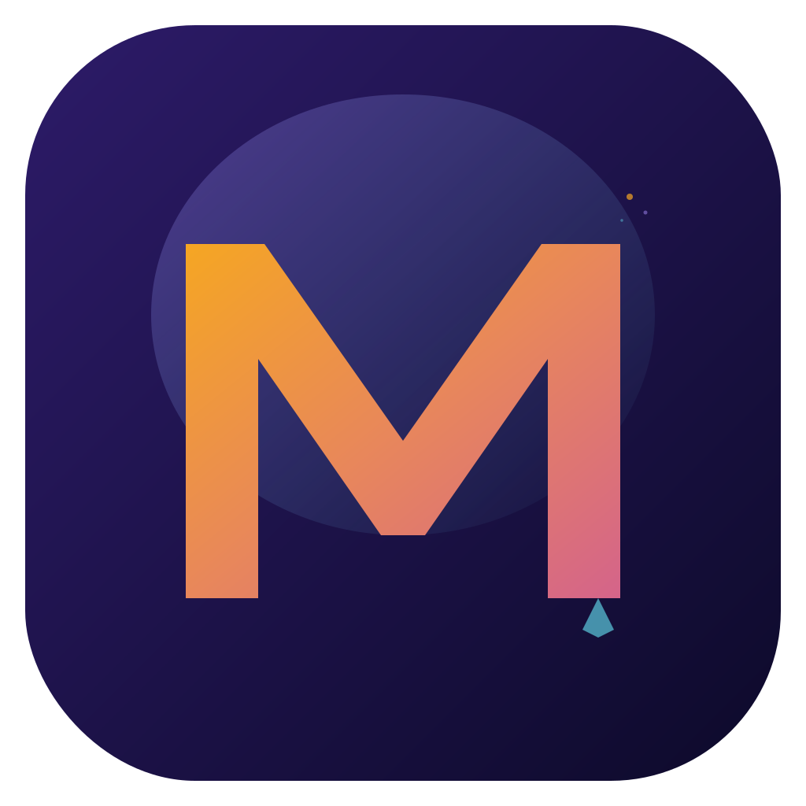

# MarkCraft V150



**40 languages** | 10 061 lines of Swift | 41 files | 60 documented languages | 6 syntax themes

---

## 🌍 Languages / Langues / Sprachen / 言語

- [🇮🇩 Bahasa Indonesia](#id)
- [🇲🇾 Bahasa Melayu](#ms)
- [🏴 Català](#ca)
- [🇩🇰 Dansk](#da)
- [🇩🇪 Deutsch](#de)
- [🇪🇪 Eesti](#et)
- [🇬🇧 English](#en)
- [🇪🇸 Español](#es)
- [🇲🇽 Español (LatAm)](#em)
- [🇫🇷 Français](#fr)
- [🇭🇷 Hrvatski](#hr)
- [🇮🇹 Italiano](#it)
- [🇱🇹 Lietuvių](#lt)
- [🇭🇺 Magyar](#hu)
- [🇳🇱 Nederlands](#nl)
- [🇳🇴 Norsk](#no)
- [🇵🇱 Polski](#pl)
- [🇧🇷 Português (BR)](#pt)
- [🇵🇹 Português (PT)](#pp)
- [🇷🇴 Română](#ro)
- [🇸🇰 Slovenčina](#sk)
- [🇸🇮 Slovenščina](#sl)
- [🇫🇮 Suomi](#fi)
- [🇸🇪 Svenska](#sv)
- [🇻🇳 Tiếng Việt](#vi)
- [🇹🇷 Türkçe](#tr)
- [🇨🇿 Čeština](#cs)
- [🇬🇷 Ελληνικά](#el)
- [🇧🇬 Български](#bg)
- [🇷🇺 Русский](#ru)
- [🇺🇦 Українська](#uk)
- [🇮🇱 עברית](#he)
- [🇸🇦 العربية](#ar)
- [🇮🇳 हिन्दी](#hi)
- [🇧🇩 বাংলা](#bn)
- [🇹🇭 ไทย](#th)
- [🇯🇵 日本語](#ja)
- [🇨🇳 简体中文](#zh)
- [🇹🇼 繁體中文](#zt)
- [🇰🇷 한국어](#ko)

---

<a id="ar"></a>

## 🇸🇦 العربية

### MarkCraft — بيئة تطوير شعرية لنظام macOS

MarkCraft هو محرر أكواد أنيق مبني بلغة Swift/SwiftUI لنظام macOS. تمييز بناء الجملة لأكثر من 30 لغة، توثيق لـ 60 لغة برمجة، عرض مقسم ولوحة الأوامر.

---

<a id="bg"></a>

## 🇧🇬 Български

### MarkCraft — Поетично IDE за macOS

MarkCraft е елегантен редактор на код, създаден в Swift/SwiftUI за macOS. Оцветяване на синтаксиса за 30+ езика, документация за 60 програмни езика, разделен изглед и палитра от команди.

---

<a id="bn"></a>

## 🇧🇩 বাংলা

### MarkCraft — macOS-এর জন্য কবিতামূলক IDE

MarkCraft macOS-এর জন্য Swift/SwiftUI-তে নির্মিত একটি সুন্দর কোড এডিটর। ৩০+ ভাষায় সিনট্যাক্স হাইলাইটিং, ৬০টি প্রোগ্রামিং ভাষার ডকুমেন্টেশন, স্প্লিট ভিউ এবং কমান্ড প্যালেট।

---

<a id="ca"></a>

## 🏴 Català

### MarkCraft — Un IDE poètic per a macOS

MarkCraft és un editor de codi elegant creat en Swift/SwiftUI per a macOS. Ressaltat de sintaxi per a 30+ llenguatges, documentació per a 60 llenguatges de programació, vista dividida i paleta d'ordres.

---

<a id="cs"></a>

## 🇨🇿 Čeština

### MarkCraft — Poetické IDE pro macOS

MarkCraft je elegantní editor kódu vytvořený ve Swift/SwiftUI pro macOS. Zvýrazňování syntaxe pro 30+ jazyků, dokumentace pro 60 programovacích jazyků, rozdělené zobrazení a paleta příkazů.

---

<a id="da"></a>

## 🇩🇰 Dansk

### MarkCraft — En poetisk IDE til macOS

MarkCraft er en elegant kodeeditor bygget i Swift/SwiftUI til macOS. Syntaksfremhævning for 30+ sprog, dokumentation for 60 programmeringssprog, delt visning og kommandopalet.

---

<a id="de"></a>

## 🇩🇪 Deutsch

### MarkCraft — Eine poetische IDE für macOS

MarkCraft ist ein eleganter Code-Editor, nativ in Swift/SwiftUI für macOS entwickelt. Syntaxhervorhebung für 30+ Sprachen, Dokumentation für 60 Programmiersprachen, geteilte Ansicht, Befehlspalette und 6 Syntaxthemen.

---

<a id="el"></a>

## 🇬🇷 Ελληνικά

### MarkCraft — Ποιητικό IDE για macOS

Το MarkCraft είναι ένας κομψός επεξεργαστής κώδικα φτιαγμένος σε Swift/SwiftUI για macOS. Επισήμανση σύνταξης για 30+ γλώσσες, τεκμηρίωση για 60 γλώσσες προγραμματισμού, διαχωρισμένη προβολή.

---

<a id="em"></a>

## 🇲🇽 Español (LatAm)

### MarkCraft — Un IDE poético para macOS

MarkCraft es un editor de código elegante para macOS. Resaltado de sintaxis para 30+ lenguajes, documentación para 60 lenguajes, vista dividida y paleta de comandos.

---

<a id="en"></a>

## 🇬🇧 English

### MarkCraft — A poetic IDE for macOS

MarkCraft is a beautiful code editor built natively in Swift/SwiftUI for macOS. Syntax highlighting for 30+ languages, documentation for 60 programming languages, split view, command palette, and 6 syntax themes.

### Installation

```bash
git clone https://github.com/markcraft-app/markcraft.git
cd markcraft && open MarkCraft.xcodeproj
```

### Requirements
- macOS 14.0+ (Sonoma) · Xcode 15.0+ · Swift 5.9+

### Shortcuts
⌘N New · ⌘O Open · ⌘S Save · ⇧⌘S Save As · ⌘P Print · ⇧⌘P Palette · ⌘F Find

---

<a id="es"></a>

## 🇪🇸 Español

### MarkCraft — Un IDE poético para macOS

MarkCraft es un editor de código elegante, creado nativamente en Swift/SwiftUI para macOS. Resaltado de sintaxis para 30+ lenguajes, documentación para 60 lenguajes de programación, vista dividida, paleta de comandos y 6 temas de sintaxis.

---

<a id="et"></a>

## 🇪🇪 Eesti

### MarkCraft — Poeetiline IDE macOS-ile

MarkCraft on elegantne koodiredaktor, mis on loodud Swift/SwiftUI-s macOS-ile. Süntaksi esiletõstmine 30+ keelele, dokumentatsioon 60 programmeerimiskeelele, jagatud vaade ja käsupalett.

---

<a id="fi"></a>

## 🇫🇮 Suomi

### MarkCraft — Poeettinen IDE macOS:lle

MarkCraft on tyylikäs koodieditori, joka on rakennettu Swift/SwiftUI:lla macOS:lle. Syntaksin korostus 30+ kielelle, dokumentaatio 60 ohjelmointikielelle, jaettu näkymä ja komentovalikko.

---

<a id="fr"></a>

## 🇫🇷 Français

### MarkCraft — Un IDE poétique pour macOS

MarkCraft est un éditeur de code élégant, conçu nativement en Swift/SwiftUI pour macOS. Coloration syntaxique pour 30+ langages, documentation pour 60 langages, vue scindée, palette de commandes et 6 thèmes syntaxiques.

---

<a id="he"></a>

## 🇮🇱 עברית

### MarkCraft — IDE פואטי ל-macOS

MarkCraft הוא עורך קוד אלגנטי שנבנה ב-Swift/SwiftUI עבור macOS. הדגשת תחביר ל-30+ שפות, תיעוד ל-60 שפות תכנות, תצוגה מפוצלת ופלטת פקודות.

---

<a id="hi"></a>

## 🇮🇳 हिन्दी

### MarkCraft — macOS के लिए काव्यात्मक IDE

MarkCraft macOS के लिए Swift/SwiftUI में बनाया गया एक सुंदर कोड एडिटर है। 30+ भाषाओं के लिए सिंटैक्स हाइलाइटिंग, 60 प्रोग्रामिंग भाषाओं का डॉक्यूमेंटेशन, स्प्लिट व्यू और कमांड पैलेट।

---

<a id="hr"></a>

## 🇭🇷 Hrvatski

### MarkCraft — Poetski IDE za macOS

MarkCraft je elegantan uređivač koda izgrađen u Swift/SwiftUI za macOS. Isticanje sintakse za 30+ jezika, dokumentacija za 60 programskih jezika, podijeljeni prikaz i paleta naredbi.

---

<a id="hu"></a>

## 🇭🇺 Magyar

### MarkCraft — Költői IDE macOS-re

A MarkCraft egy elegáns kódszerkesztő, amely Swift/SwiftUI-ban készült macOS-re. Szintaxiskiemelés 30+ nyelvhez, dokumentáció 60 programozási nyelvhez, osztott nézet és parancspaletta.

---

<a id="id"></a>

## 🇮🇩 Bahasa Indonesia

### MarkCraft — IDE puitis untuk macOS

MarkCraft adalah editor kode elegan yang dibangun dengan Swift/SwiftUI untuk macOS. Penyorotan sintaks untuk 30+ bahasa, dokumentasi untuk 60 bahasa pemrograman, tampilan terpisah dan palet perintah.

---

<a id="it"></a>

## 🇮🇹 Italiano

### MarkCraft — Un IDE poetico per macOS

MarkCraft è un elegante editor di codice creato nativamente in Swift/SwiftUI per macOS. Evidenziazione della sintassi per 30+ linguaggi, documentazione per 60 linguaggi, vista divisa e tavolozza dei comandi.

---

<a id="ja"></a>

## 🇯🇵 日本語

### MarkCraft — macOS用の詩的なIDE

MarkCraftはmacOS用にSwift/SwiftUIでネイティブに構築された美しいコードエディタです。30以上の言語のシンタックスハイライト、60のプログラミング言語のドキュメント、分割ビュー、コマンドパレット、6つのシンタックステーマ。

---

<a id="ko"></a>

## 🇰🇷 한국어

### MarkCraft — macOS를 위한 시적인 IDE

MarkCraft는 macOS용 Swift/SwiftUI로 네이티브하게 구축된 아름다운 코드 에디터입니다. 30개 이상 언어의 구문 강조, 60개 프로그래밍 언어 문서, 분할 보기, 명령 팔레트, 6가지 구문 테마.

---

<a id="lt"></a>

## 🇱🇹 Lietuvių

### MarkCraft — Poetinė IDE macOS

MarkCraft yra elegantiškas kodo redaktorius, sukurtas Swift/SwiftUI macOS sistemai. Sintaksės paryškinimas 30+ kalbų, dokumentacija 60 programavimo kalbų, padalintas vaizdas ir komandų paletė.

---

<a id="ms"></a>

## 🇲🇾 Bahasa Melayu

### MarkCraft — IDE puitis untuk macOS

MarkCraft ialah editor kod yang elegan, dibina dalam Swift/SwiftUI untuk macOS. Penyerlahan sintaks untuk 30+ bahasa, dokumentasi untuk 60 bahasa pengaturcaraan, paparan terbahagi dan palet arahan.

---

<a id="nl"></a>

## 🇳🇱 Nederlands

### MarkCraft — Een poëtische IDE voor macOS

MarkCraft is een elegante code-editor, gebouwd in Swift/SwiftUI voor macOS. Syntax-highlighting voor 30+ talen, documentatie voor 60 programmeertalen, gesplitste weergave en opdrachtenpalet.

---

<a id="no"></a>

## 🇳🇴 Norsk

### MarkCraft — En poetisk IDE for macOS

MarkCraft er en elegant kodeeditor bygget i Swift/SwiftUI for macOS. Syntaksutheving for 30+ språk, dokumentasjon for 60 programmeringsspråk, delt visning og kommandopalett.

---

<a id="pl"></a>

## 🇵🇱 Polski

### MarkCraft — Poetyczne IDE dla macOS

MarkCraft to elegancki edytor kodu zbudowany w Swift/SwiftUI dla macOS. Podświetlanie składni dla 30+ języków, dokumentacja dla 60 języków programowania, widok podzielony i paleta poleceń.

---

<a id="pp"></a>

## 🇵🇹 Português (PT)

### MarkCraft — Uma IDE poética para macOS

MarkCraft é um editor de código elegante para macOS, construído em Swift/SwiftUI. Destaque de sintaxe para 30+ linguagens, documentação para 60 linguagens e paleta de comandos.

---

<a id="pt"></a>

## 🇧🇷 Português (BR)

### MarkCraft — Uma IDE poética para macOS

MarkCraft é um editor de código elegante, construído nativamente em Swift/SwiftUI para macOS. Destaque de sintaxe para 30+ linguagens, documentação para 60 linguagens, visualização dividida e paleta de comandos.

---

<a id="ro"></a>

## 🇷🇴 Română

### MarkCraft — Un IDE poetic pentru macOS

MarkCraft este un editor de cod elegant, construit în Swift/SwiftUI pentru macOS. Evidențierea sintaxei pentru 30+ limbaje, documentație pentru 60 limbaje de programare, vizualizare împărțită și paletă de comenzi.

---

<a id="ru"></a>

## 🇷🇺 Русский

### MarkCraft — Поэтическая IDE для macOS

MarkCraft — элегантный редактор кода на Swift/SwiftUI для macOS. Подсветка синтаксиса для 30+ языков, документация для 60 языков программирования, разделённый вид и палитра команд.

---

<a id="sk"></a>

## 🇸🇰 Slovenčina

### MarkCraft — Poetické IDE pre macOS

MarkCraft je elegantný editor kódu vytvorený v Swift/SwiftUI pre macOS. Zvýrazňovanie syntaxe pre 30+ jazykov, dokumentácia pre 60 programovacích jazykov, rozdelené zobrazenie a paleta príkazov.

---

<a id="sl"></a>

## 🇸🇮 Slovenščina

### MarkCraft — Poetični IDE za macOS

MarkCraft je eleganten urejevalnik kode, zgrajen v Swift/SwiftUI za macOS. Označevanje sintakse za 30+ jezikov, dokumentacija za 60 programskih jezikov, razdeljen pogled in ukazna paleta.

---

<a id="sv"></a>

## 🇸🇪 Svenska

### MarkCraft — En poetisk IDE för macOS

MarkCraft är en elegant kodredigerare byggd i Swift/SwiftUI för macOS. Syntaxmarkering för 30+ språk, dokumentation för 60 programmeringsspråk, delad vy och kommandopalett.

---

<a id="th"></a>

## 🇹🇭 ไทย

### MarkCraft — IDE เชิงกวีสำหรับ macOS

MarkCraft เป็นโปรแกรมแก้ไขโค้ดที่สวยงาม สร้างด้วย Swift/SwiftUI สำหรับ macOS ไฮไลท์ไวยากรณ์สำหรับ 30+ ภาษา เอกสารสำหรับ 60 ภาษาโปรแกรมมิง มุมมองแยก และพาเลทคำสั่ง

---

<a id="tr"></a>

## 🇹🇷 Türkçe

### MarkCraft — macOS için poetik IDE

MarkCraft, macOS için Swift/SwiftUI ile oluşturulmuş zarif bir kod editörüdür. 30+ dil için sözdizimi vurgulama, 60 programlama dili için dokümantasyon, bölünmüş görünüm ve komut paleti.

---

<a id="uk"></a>

## 🇺🇦 Українська

### MarkCraft — Поетична IDE для macOS

MarkCraft — елегантний редактор коду, створений на Swift/SwiftUI для macOS. Підсвічування синтаксису для 30+ мов, документація для 60 мов програмування, розділений вигляд і палітра команд.

---

<a id="vi"></a>

## 🇻🇳 Tiếng Việt

### MarkCraft — IDE thơ mộng cho macOS

MarkCraft là trình soạn thảo mã nguồn đẹp mắt, được xây dựng bằng Swift/SwiftUI cho macOS. Tô sáng cú pháp cho 30+ ngôn ngữ, tài liệu cho 60 ngôn ngữ lập trình, chế độ chia đôi và bảng lệnh.

---

<a id="zh"></a>

## 🇨🇳 简体中文

### MarkCraft — macOS诗意IDE

MarkCraft是一款为macOS原生构建的优雅代码编辑器，使用Swift/SwiftUI。支持30+种语言的语法高亮、60种编程语言的文档、分屏视图、命令面板和6种语法主题。

---

<a id="zt"></a>

## 🇹🇼 繁體中文

### MarkCraft — macOS詩意IDE

MarkCraft是一款為macOS原生構建的優雅程式碼編輯器，使用Swift/SwiftUI。支援30+種語言的語法高亮、60種程式語言的文件、分割視圖、命令面板和6種語法主題。

---

